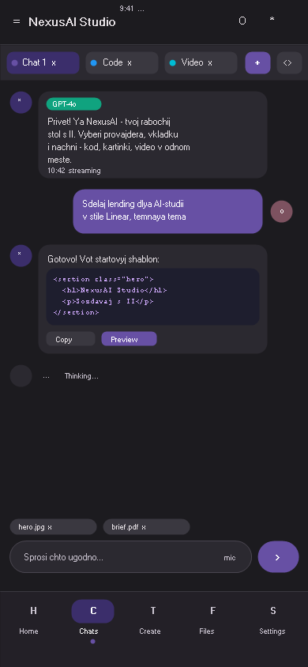
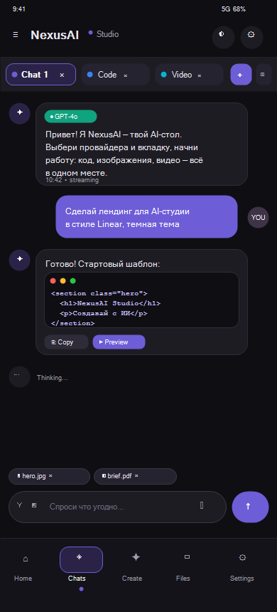

# NexsusAI

Multi-AI workspace for Android — work with multiple AI providers simultaneously in independent tabs.

[](https://github.com/nvros86/NexsusAI/actions/workflows/android.yml)
[](https://github.com/nvros86/NexsusAI/releases)

## Features

### Core
- **Multi-tab Workspace** — independent AI tabs with separate message history
- **AI Provider System** — OpenAI, Anthropic, Gemini, and custom API endpoints
- **Streaming Responses** — real-time AI response generation

### Killer Features
- **AI Marketplace** — browse and connect to AI providers with one tap (10 presets)
- **Prompt Library** — 16 built-in prompts across 9 categories with search and favorites
- **Code Playground** — HTML/CSS/JS editor with live WebView preview
- **Module System** — enable/disable app modules (11 built-in)
- **AI Router** — automatic best-provider selection with 5 routing strategies and failover
- **Split View** — compare responses from 2-4 AI providers side by side with ratings
- **Voice Mode** — voice conversation with AI (STT → LLM → TTS)

### UI/UX
- Material 3 dark purple theme
- Navigation: bottom bar + drawer + FAB
- Onboarding (4 pages)
- Chat export (Markdown, TXT, JSON, HTML)
- File manager with gallery and filters
- Code editor with syntax highlighting
- Encrypted API key storage

## Architecture

- **Kotlin 2.1.0**, Jetpack Compose, MVVM + Clean Architecture
- Multi-module: `app`, `core`, `domain`, `data`, `di`, `feature:tabs`, `feature:settings`, `feature:editor`, `feature:aiprovider`
- Hilt DI, Room DB, Ktor HTTP, DataStore Preferences
- GitHub Actions CI/CD (build + test + lint)

## Setup

### Prerequisites
- Android Studio Hedgehog or later
- JDK 17
- Android SDK 35

### Build
```bash
git clone https://github.com/nvros86/NexsusAI.git
cd NexsusAI
./gradlew build
```

### Install
Download the latest APK from [Releases](https://github.com/nvros86/NexsusAI/releases) or build from source.

## Screenshots

| Marketplace | Split View | Voice Mode |
|------------|------------|------------|
|  |  | |

## Contributing

See [CONTRIBUTING.md](CONTRIBUTING.md) for guidelines.

## License

This project is licensed under the MIT License — see [LICENSE](LICENSE) for details.
